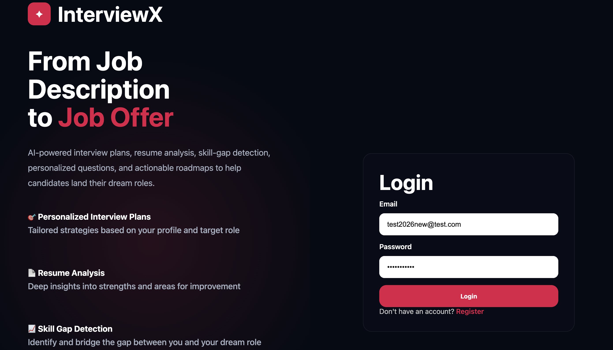
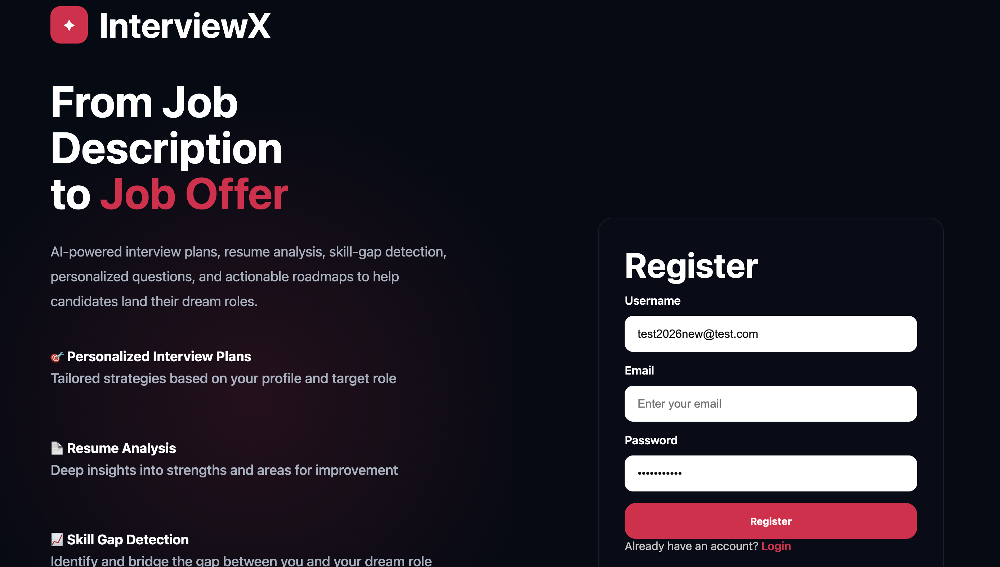
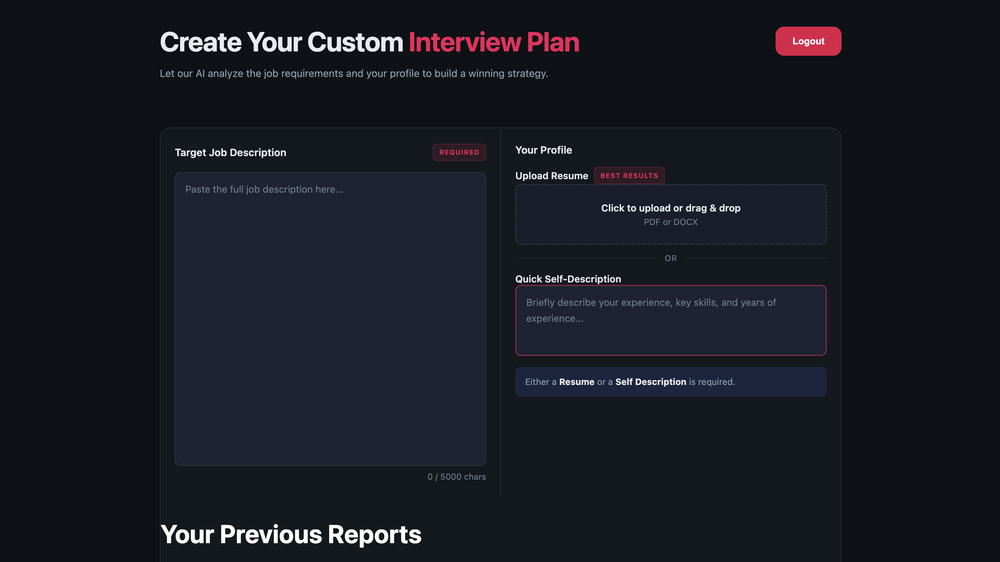
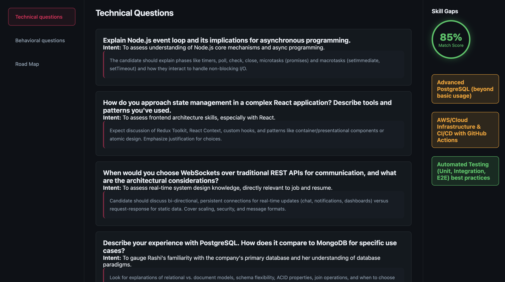
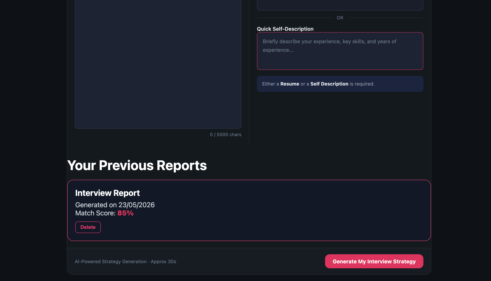

# 🚀 InterviewX

AI-powered Interview Preparation Platform that analyzes resumes, compares them against job descriptions, identifies skill gaps, generates personalized interview questions, and creates tailored interview preparation roadmaps.

---

## ✨ Features

| Feature | Description |
|----------|-------------|
| Resume Analysis | Extracts and analyzes resume content using AI |
| Job Description Matching | Compares resume against target job requirements |
| Match Score | Calculates candidate-job compatibility score |
| Technical Questions | Generates role-specific technical interview questions |
| Behavioral Questions | Generates behavioral interview questions with model answers |
| Skill Gap Analysis | Identifies missing skills and improvement areas |
| Personalized Roadmap | Creates structured interview preparation plans |
| Resume PDF Generator | Generates tailored resumes based on target roles |
| Authentication System | Secure Login/Register using JWT Authentication |
| User-Specific Reports | Every user can access only their own interview reports |
| Report History | Stores previous interview reports for future access |
| Logout Functionality | Secure user logout with session handling |

---

## 🛠 Tech Stack

| Category | Technologies |
|-----------|-------------|
| Frontend | React.js, React Router, SCSS, Axios |
| Backend | Node.js, Express.js |
| Database | MongoDB, Mongoose |
| Authentication | JWT, HTTP-only Cookies |
| AI Integration | Google Gemini API |
| Resume Parsing | pdf-parse |
| File Uploads | Multer |
| PDF Generation | Puppeteer |
| Deployment | Vercel / Render |

---

## 📂 Project Structure

| Folder | Purpose |
|----------|-------------|
| Frontend | React Frontend Application |
| Backend | Express Backend API |
| Backend/controllers | Business Logic |
| Backend/routes | API Routes |
| Backend/models | MongoDB Models |
| Backend/services | Gemini AI Services |
| Backend/middlewares | Authentication & Upload Middleware |
| Backend/utils | Helper Functions |

---

## 🔐 Authentication Features

| Functionality | Status |
|--------------|--------|
| User Registration | ✅ |
| User Login | ✅ |
| JWT Authentication | ✅ |
| Protected Routes | ✅ |
| Logout Functionality | ✅ |
| User-Specific Data Access | ✅ |

---

## 📊 Generated Interview Report Includes

| Component | Description |
|------------|-------------|
| Match Score | Resume vs Job Description Compatibility |
| Technical Questions | AI-generated technical interview questions |
| Behavioral Questions | AI-generated behavioral interview questions |
| Skill Gaps | Missing skills required for role |
| Personalized Preparation Plan | Learning roadmap and action plan |
| Resume Suggestions | Improvements for target role |
| Tailored Resume PDF | Downloadable AI-generated resume |

---

## ⚙️ Installation

### Clone Repository

```bash
git clone https://github.com/YOUR_USERNAME/InterviewX.git
```

---

### Install Frontend Dependencies

```bash
cd Frontend
npm install
```

---

### Install Backend Dependencies

```bash
cd ../Backend
npm install
```

---

## 🔑 Environment Variables

Create a `.env` file inside the Backend folder:

```env
PORT=3000

MONGODB_URI=YOUR_MONGODB_CONNECTION_STRING

JWT_SECRET=YOUR_SECRET_KEY

GEMINI_API_KEY=YOUR_GEMINI_API_KEY
```

---

## ▶️ Run Backend

```bash
npm run dev
```

---

## ▶️ Run Frontend

```bash
cd Frontend

npm run dev
```

---

## 📸 Screenshots

### Login Page



---

### Register Page



---

### Dashboard



---

### Interview Report



---

### Resume Generator



---

## 🎯 Future Enhancements

| Enhancement | Status |
|-------------|--------|
| Mock Interview Simulator | 🔄 Planned |
| Voice-based Interview Practice | 🔄 Planned |
| AI Feedback on Answers | 🔄 Planned |
| Company-wise Interview Sets | 🔄 Planned |
| Interview Performance Analytics | 🔄 Planned |
| Deployment Improvements | 🔄 Planned |

---

## 👩‍💻 Author

**Rashi Gupta**

GitHub: https://github.com/TheRashi

LinkedIn: Add Your LinkedIn Profile

---

## ⭐ Support

If you found this project helpful:

- Star the repository ⭐
- Fork the project 🍴
- Share it with others 🚀

---

## 📜 License

This project is licensed under the MIT License.